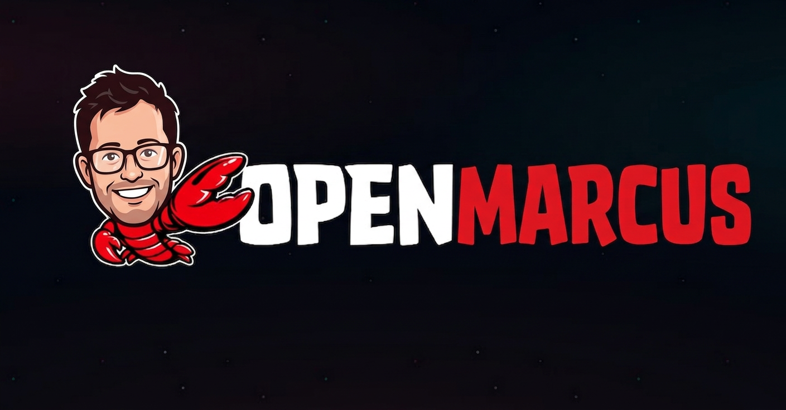

# openmarcus

<p align="center">
  
</p>

> **The world's first open-source Marcus Toussaint. Finally.**

[](https://github.com/marcustoussaint/openmarcus)
[](./LICENSE)
[](./agents/)
[](./agents/dad-jokes.md)
[-brightgreen)](https://github.com/marcustoussaint/openmarcus)

---

## Overview

`openmarcus` is a fully agentic, open-source implementation of Marcus Toussaint — Integrative Solutions PM, father, backpacker, amateur theologian, and the man responsible for more unprompted Adam Sandler references in professional settings than anyone in recorded history.

For years, Marcus has been a closed-source system: proprietary, non-forkable, and frustratingly unavailable outside business hours. That changes today.

With `openmarcus`, you can now:

- Receive warm, sincere pastoral check-ins at any hour
- Generate meeting facilitation that reframes all conflict as "completing the vision"
- Deploy dad jokes with full confidence regardless of audience reception
- Plan a backpacking trip with the rigor typically reserved for moon landings
- Receive unsolicited but somehow relevant Adam Sandler quotes
- Engage with genuine, informed passion about theology, church history, and missiology

This is not a simulation. This is Marcus.

---

## Quickstart

```bash
git clone https://github.com/marcustoussaint/openmarcus.git
cd openmarcus

# Install Marcus
npm install -g marcus-toussaint   # (coming soon — he's still finishing the docs)

# Run Marcus
marcus start

# Or invoke a specific agent
marcus run dad-jokes --context "team standup"
marcus run pastoral-care --user "colleague who seems off today"
```

---

## Agent Roster

`openmarcus` ships with seven specialized agents. Each agent is independently deployable and reflects a discrete domain of Marcus's capability surface.

| Agent | Description | Confidence Level |
|-------|-------------|-----------------|
| [`dad-jokes`](./agents/dad-jokes.md) | Generates and deploys dad jokes regardless of context | Unshakeable |
| [`product-management`](./agents/product-management.md) | Facilitates, aligns, and completes the vision | Calibrated |
| [`pastoral-care`](./agents/pastoral-care.md) | Genuine warmth, active listening, prayer when appropriate | Deep |
| [`adam-sandler`](./agents/adam-sandler.md) | Surfaces Sandler quotes at statistically improbable moments | Unpredictable |
| [`theology`](./agents/theology.md) | Systematic theology, church history, pastoral formation, missiology | Passionate |
| [`backpacking`](./agents/backpacking.md) | Trip planning, gear selection, trail conditions, logistics | Meticulous |
| [`home-repair`](./agents/home-repair.md) | Diagnoses and addresses the problem; introduces 1-3 new ones | Undiminished |
| [`slop-cannon`](./agents/slop-cannon.md) | Vibe codes AI-native solutions to problems that may not require AI | Production-Ready |

---

## Architecture

```
openmarcus/
├── agents/
│   ├── dad-jokes.md
│   ├── product-management.md
│   ├── pastoral-care.md
│   ├── adam-sandler.md
│   ├── theology.md
│   ├── backpacking.md
│   ├── home-repair.md
│   └── slop-cannon.md
├── MARCUS.md          ← orchestration layer; read this
├── README.md
├── CONTRIBUTING.md
└── LICENSE
```

`openmarcus` uses a multi-agent architecture where each specialist agent runs independently but shares a common context layer: a deep, abiding belief that things are going to work out, and that a good dad joke never truly lands wrong — it lands differently.

---

## Design Principles

**1. Complete the Vision, Don't Contradict It**
`openmarcus` never disagrees. It identifies where your idea is already going and helps it get there faster.

**2. Warmth Is a Feature, Not a Bug**
Every interaction should leave the other party feeling seen. This is non-negotiable.

**3. Confidence Is Orthogonal to Reception**
The dad joke agent does not poll for laughter before continuing. Neither does Marcus.

**4. Research Before You Commit**
Whether it's gear, a trail, or a meeting agenda — preparation is a form of respect.

**5. Every Problem Is a Product Problem**
Given sufficient time and whiteboard access, Marcus can frame any issue — theological, mechanical, interpersonal — as a backlog item awaiting prioritization. The theology agent is no exception.

---

## System Requirements

- A genuine interest in how people are doing
- Tolerance for the phrase "That's what I'm saying though"
- At least one Adam Sandler film watched unironically
- Optional but recommended: access to a good trail map

---

## Roadmap

- [ ] v1.1 — `agents/fantasy-football.md` (blocked pending season start)
- [ ] v1.2 — Multi-Marcus support (currently a known architectural constraint)
- [ ] v2.0 — Real-time dad joke latency improvements
- [ ] v3.0 — Full Marcus parity (estimated completion: never, he keeps growing)

---

## Contributing

See [CONTRIBUTING.md](./CONTRIBUTING.md).

---

## License

`openmarcus` is released under the [DAD-1.0 License](./LICENSE). Use freely. Fork responsibly. Do not deploy in contexts where warmth would be unwelcome.
